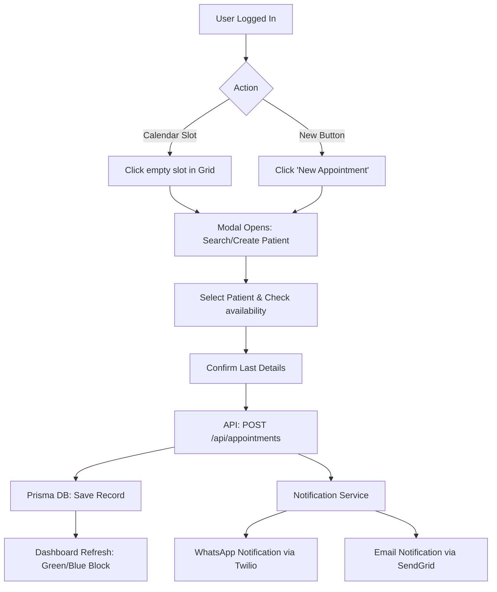

# 🏥 MedCita - Application Flow & Architecture

This document explains how the MedCita application works, its user roles, and the core booking workflow.

## 👥 User Roles

| Role | Permissions |
| :--- | :--- |
| **Admin** | Manages clinics, adds/deletes doctors, full access to all schedules. |
| **Doctor** | Manages own schedule, sees own patient list, manages their availability. |
| **Secretary** | Manages agendas for one or more doctors, registers patients, handles incoming requests. |
| **Patient** | The end-user who receives notifications via WhatsApp/Email. |

## 🔄 Core Booking Workflow

The following diagram illustrates the interaction between the system and the user when scheduling an appointment.

## ⚙️ Technical Components

1.  **Frontend (React + Vite):** Uses `react-big-calendar` for the grid and `Tailwind CSS` for the premium UI.
2.  **Backend (Express + Node.js):** REST API with JWT authentication.
3.  **Database (PostgreSQL + Prisma):** Stores relationships between Doctors, Patients, and Appointments.
4.  **Notifications:**
    *   **Twilio:** Sends real-time WhatsApp messages for confirmation.
    *   **SendGrid:** Sends professional email notifications if a valid email is provided.

## 🕒 Availability Engine

The system uses a "Block & Slot" logic:
- Doctors define **Working Hours** (e.g., Mon-Fri 08:00 - 18:00).
- The engine calculates 30-minute **Slots**.
- If a slot is occupied in the DB, the UI marks it as **Occupied (Orange)**.
- If it's a past time, the UI **Blocks** it for safety.

---
*Created by Antigravity for the MedCita project.*
